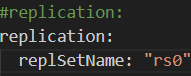

# Leveraging Database Solutions for Hotel Management

## Project structure
 ```sh
├── Codes/
│ └── static/ # contains css, js and images used in project
│ └── templates/ # contains HTML templates
│ └── app.py # main file to run the web app
│ └── conditions_check.py # has several utility functions
├── dataset/
│ ├── MongoDB collections/ # contains mongodb collections in json
│ └── countries.csv # list of countries
│ └── Final_Preprocessed_Dataset_0.csv # bookings of even people count
│ └── Final_Preprocessed_Dataset_1.csv # bookings of odd people count
│ └── hotel_bookings.csv # original dataset
│ └── meal.csv # meals data
│ └── room.csv # room types data
│ └── users.csv # users data
├── Preprocessing data/
│ ├── Data Preprocessing and Visualization.ipynb # file for preprocessing the dataset
├──.gitignore
├──LICENSE
├──README.md
├──requirements.txt
  ```

## Instructions to execute the project


Clone the repository to your local directory by entering the following command:
  ```sh
  git clone "https://github.com/AnshumanMohanty-2001/Unveiling-Insights-through-Data-driven-Exploration-of-Cricket-World-Cup-2023.git"
  ```

<br>

Navigate inside the HOTEL-RESERVATION-MANAGER directory and import the MongoDB collections into the Hotel_Reservation database

```sh
mongoimport --db 'Hotel_Reservation' --collection users --jsonArray --file "dataset/MongoDB collections/Hotel_Reservation.users.json"
```

<br>

```sh
mongoimport --db Hotel_Reservation --collection booking_0 --jsonArray --file "dataset/
MongoDB collections/Hotel_Reservation.booking_0.json"
```

<br>

```sh
mongoimport --db 'Hotel_Reservation' --collection booking_1 --jsonArray --file "dataset/MongoDB collections/Hotel_Reservation.booking_1.json"
```

<br>

```sh
mongoimport --db 'Hotel_Reservation' --collection rooms --jsonArray --file "dataset/MongoDB collections/Hotel_Reservation.rooms.json"
```

<br>

```sh
mongoimport --db 'Hotel_Reservation' --collection meals --jsonArray --file "dataset/MongoDB collections/Hotel_Reservation.meals.json"
```

<br>

```sh
mongoimport --db 'Hotel_Reservation' --collection countries --jsonArray --file "dataset/MongoDB collections/Hotel_Reservation.countries.json"
```
<br>
<br>
The following are the steps to perform database replication.

<br>

In C drive, make folder data. Inside data, make db (primary node), db1 and db2 (secondary nodes).
The following would be the structure

```sh
├── C:/
│ └── data/
     ├── db/
     ├── db1/
     ├── db2/
```

<br>
Stop the MongoDB server from the task manager, if it is running.

Open the mongod.cfg file and add the replica set.<br><br>

<br><br>
Start the MongoDB server from the task manager.
<br>

Run the following commands in terminal.

```sh
mongod --port 27017 --dbpath "C:\data\db" --replSet rs0 --bind_ip localhost
```

<br>

```sh
mongod --port 27018 --dbpath "C:\data\db1" --replSet rs0 --bind_ip localhost
```

<br>

```sh
mongod --port 27019 --dbpath "C:\data\db2" --replSet rs0 --bind_ip localhost
```
<br>
Run the mongoDB database on port 27017
<br><br>

```sh
mongod --port 27017
```

<br>

Initiate the settings to add members to replica set
<br>

```sh
rs.initiate({_id: "rs0", members: [{_id: 0, host: "localhost:27017"}, {_id: 1, host: "localhost:27018"}, {_id: 2, host: "localhost:27019"}]});
```

<br>
To ensure that the secondary nodes can read the data, execute the following commands.
<br><br>
Run the mongoDB database on port 27018
<br><br>

```sh
mongod --port 27018
```

<br>

Set the read privilege for secondary nodes.
<br>

```sh
db.getMongo().setReadPref('secondary')
```

Repeat the above two steps for port 27019.<br><br><br>
After successfully completing the replication functionality, we can now run the project.<br><br>
Create a virtual environment

  ```sh
  conda create -n venv
  ```
Here, venv is the name of virtual environment.<br><br>
Activate the virtual environment venv

  ```sh
  conda activate venv
  ```
<br>
Install project requirements.
<br><br>

```sh
pip install -r requirements.txt
```
<br>
Run the web application with the following python command.
<br><br>

```sh
python Codes/app.py
```